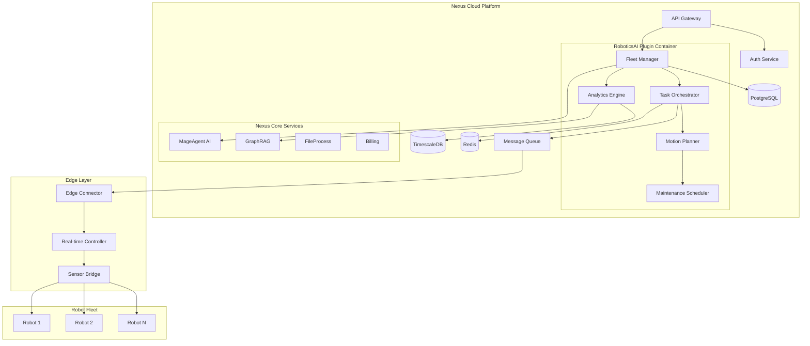
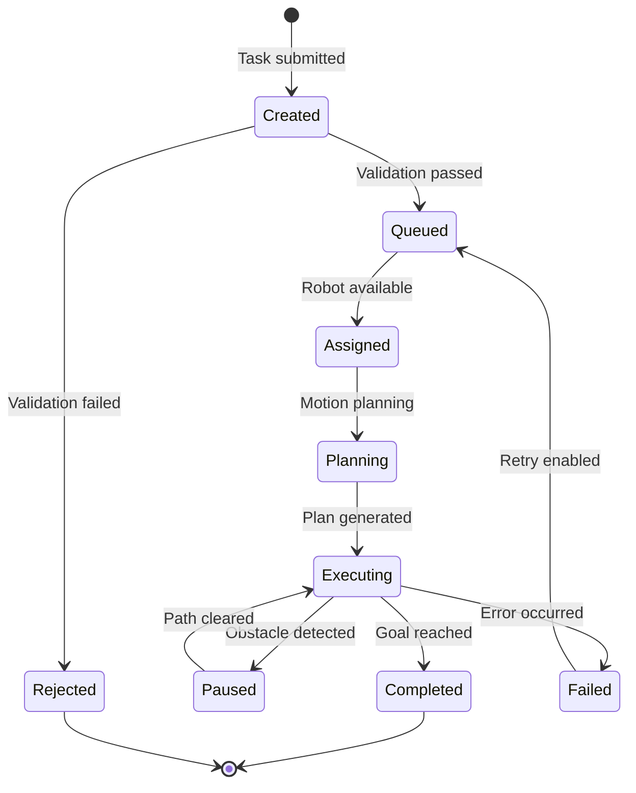
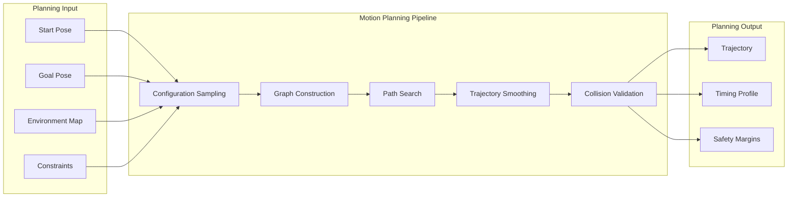
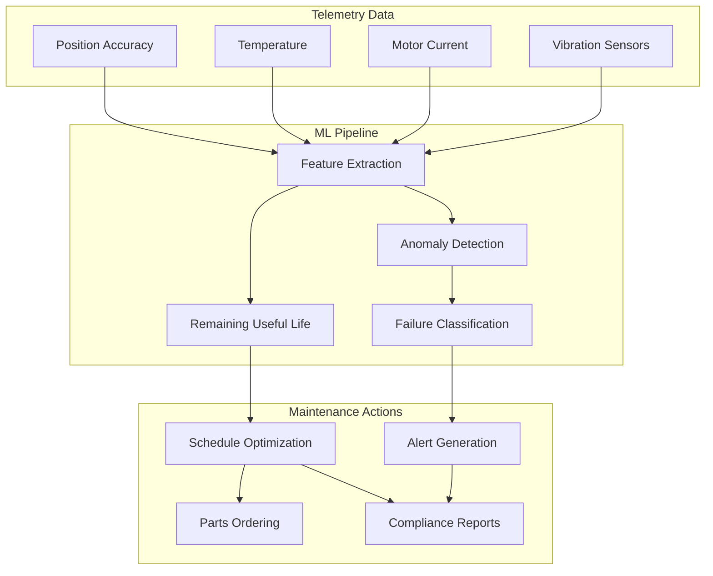
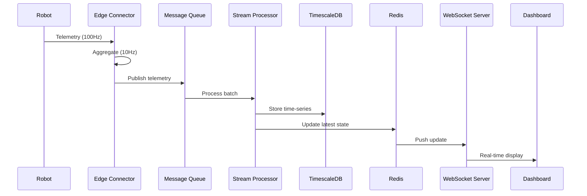
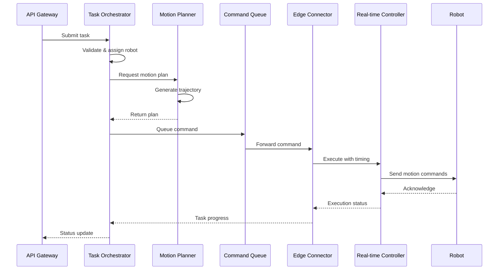
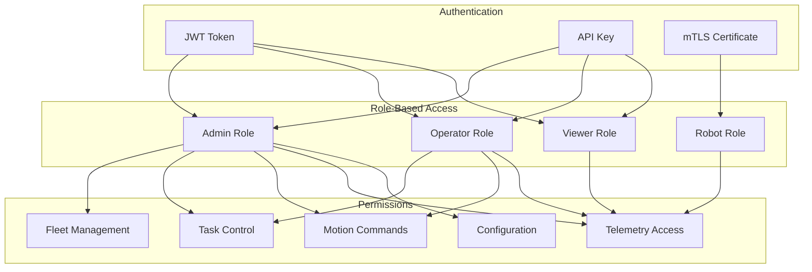
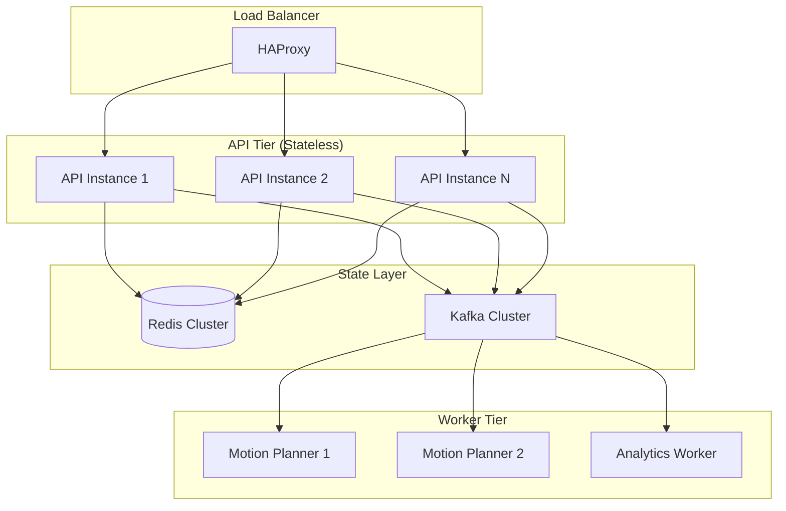
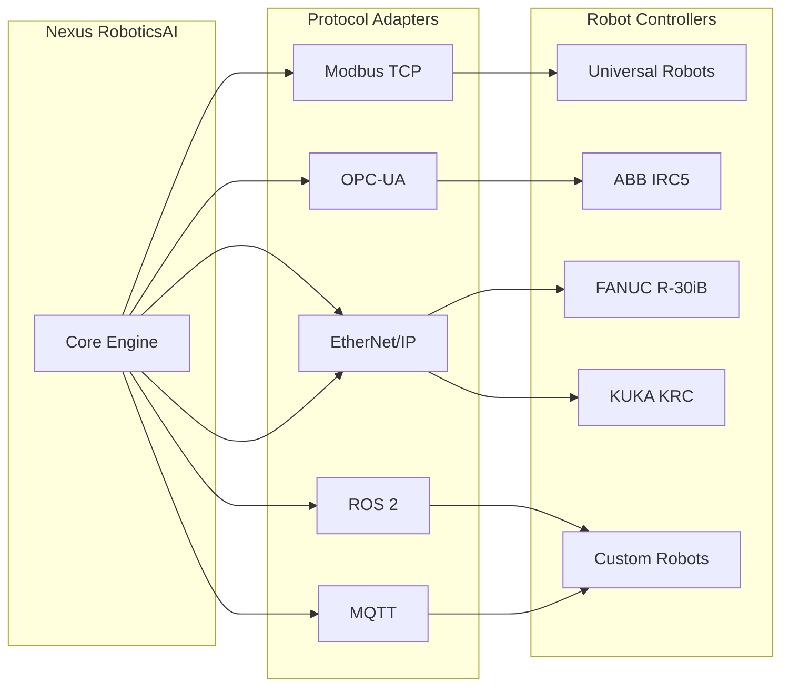
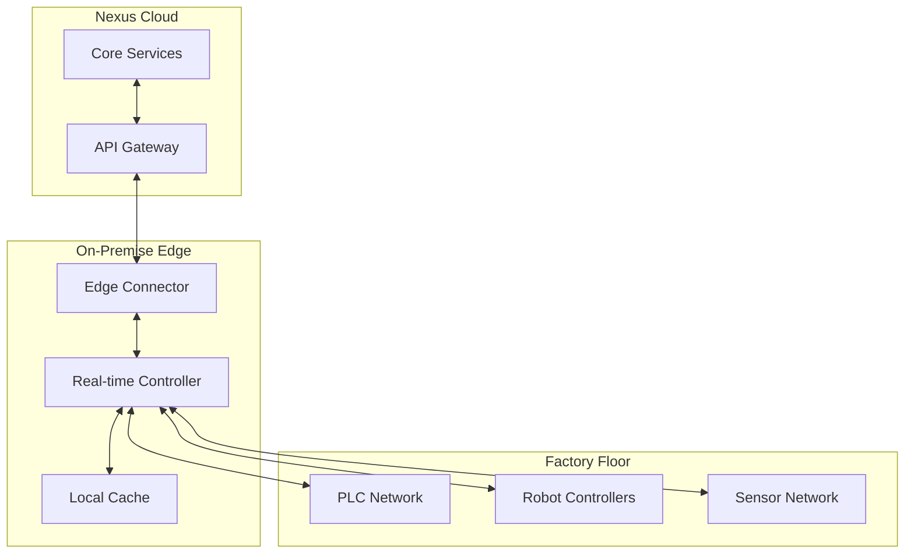

# Architecture: RoboticsAI - Autonomous Robot Fleet Management

A comprehensive technical overview of the Nexus RoboticsAI plugin architecture, including system components, data flows, security model, and integration patterns.

---

## System Overview

Nexus RoboticsAI is designed as a distributed, event-driven system that provides real-time robot fleet management at scale. The architecture supports edge-to-cloud hybrid deployments, enabling sub-10ms latency for critical motion control while leveraging cloud AI for optimization and analytics.



---

## Core Components

### Fleet Manager

The central coordination hub for all robot operations.

| Component | Responsibility | Technology |
|-----------|----------------|------------|
| **Robot Registry** | Track connected robots and capabilities | PostgreSQL + Redis cache |
| **Status Monitor** | Real-time health and position tracking | WebSocket + TimescaleDB |
| **Connection Manager** | Handle robot connections across protocols | Protocol adapters |
| **Event Router** | Route events to appropriate handlers | Apache Kafka |

**Key Interfaces:**

```typescript
interface FleetManager {
  // Robot lifecycle
  registerRobot(config: RobotConfig): Promise<Robot>;
  deregisterRobot(robotId: string): Promise<void>;
  getRobotStatus(robotId: string): Promise<RobotStatus>;

  // Fleet operations
  getFleetStatus(): Promise<FleetStatus>;
  findAvailableRobots(criteria: RobotCriteria): Promise<Robot[]>;
  broadcastCommand(command: FleetCommand): Promise<void>;

  // Events
  onRobotConnected(handler: (robot: Robot) => void): void;
  onRobotDisconnected(handler: (robotId: string) => void): void;
  onStatusChange(handler: (status: RobotStatusChange) => void): void;
}
```

### Task Orchestrator

Manages task lifecycle from creation through completion.



**Task Priority Queue:**

```typescript
interface TaskQueue {
  priority: 'critical' | 'high' | 'normal' | 'low';
  maxRetries: number;
  timeout: number;
  constraints: {
    requiredCapabilities: string[];
    preferredRobots: string[];
    excludeRobots: string[];
    deadline?: Date;
  };
}
```

### Motion Planner

AI-powered trajectory generation with collision avoidance.



**Planning Algorithms:**

| Algorithm | Use Case | Latency | Optimality |
|-----------|----------|---------|------------|
| RRT-Connect | Complex environments | ~50ms | Feasible |
| RRT* | Optimal paths required | ~200ms | Asymptotically optimal |
| CHOMP | Smooth trajectories | ~100ms | Locally optimal |
| STOMP | Noisy environments | ~150ms | Stochastic optimal |
| AI Hybrid | Dynamic replanning | ~20ms | Learned optimal |

### Maintenance Scheduler

Predictive maintenance powered by machine learning.



---

## Data Flow

### Real-time Telemetry Pipeline



### Command Execution Flow



---

## Security Model

### Authentication & Authorization



### Network Security

| Layer | Protection | Implementation |
|-------|------------|----------------|
| **Transport** | Encryption in transit | TLS 1.3, mTLS for robots |
| **Authentication** | Identity verification | JWT + API keys, X.509 certs |
| **Authorization** | Access control | RBAC with fine-grained permissions |
| **Rate Limiting** | DoS protection | Token bucket per API key |
| **Audit** | Activity logging | All commands logged to immutable store |

### Robot Communication Security

```typescript
interface RobotSecurityConfig {
  // Connection security
  transport: 'tls' | 'dtls' | 'noise';
  certificateAuth: boolean;
  certificateRotationDays: number;

  // Command security
  commandSigning: boolean;
  replayProtection: boolean;
  maxCommandAge: number; // milliseconds

  // Safety limits
  geofence: GeoFenceConfig;
  velocityLimits: VelocityLimits;
  emergencyStop: EmergencyStopConfig;
}
```

---

## API Reference

### Base URL

```
https://api.adverant.ai/proxy/nexus-robotics/api/v1
```

### Fleet Endpoints

| Method | Path | Description |
|--------|------|-------------|
| `GET` | `/fleet` | Get fleet status |
| `POST` | `/fleet` | Register new robot |
| `GET` | `/fleet/:robotId` | Get robot details |
| `PUT` | `/fleet/:robotId` | Update robot config |
| `DELETE` | `/fleet/:robotId` | Deregister robot |

### Task Endpoints

| Method | Path | Description |
|--------|------|-------------|
| `POST` | `/tasks` | Create task |
| `GET` | `/tasks` | List tasks |
| `GET` | `/tasks/:taskId` | Get task status |
| `PUT` | `/tasks/:taskId/cancel` | Cancel task |
| `POST` | `/tasks/batch` | Create batch tasks |

### Navigation Endpoints

| Method | Path | Description |
|--------|------|-------------|
| `POST` | `/navigation/plan` | Generate motion plan |
| `POST` | `/navigation/execute` | Execute motion plan |
| `GET` | `/navigation/plans/:planId` | Get plan details |
| `PUT` | `/navigation/plans/:planId/pause` | Pause execution |

### Telemetry Endpoints

| Method | Path | Description |
|--------|------|-------------|
| `GET` | `/telemetry/:robotId` | Get latest telemetry |
| `GET` | `/telemetry/:robotId/history` | Get historical data |
| `WS` | `/telemetry/:robotId/stream` | Stream real-time telemetry |

### Maintenance Endpoints

| Method | Path | Description |
|--------|------|-------------|
| `GET` | `/maintenance/predictions` | Get maintenance forecast |
| `POST` | `/maintenance/schedule` | Schedule maintenance |
| `GET` | `/maintenance/history` | Get maintenance history |

---

## Scaling Characteristics

### Horizontal Scaling



### Performance Benchmarks

| Metric | Single Node | Cluster (3 nodes) | Target |
|--------|-------------|-------------------|--------|
| API Requests/sec | 5,000 | 15,000 | 20,000 |
| Robots Managed | 100 | 500 | 1,000 |
| Telemetry Throughput | 10,000 msg/s | 50,000 msg/s | 100,000 msg/s |
| Motion Plan Latency | 50ms p95 | 50ms p95 | <100ms |
| Task Dispatch Latency | 20ms p95 | 25ms p95 | <50ms |

### Resource Requirements

| Tier | vCPU | Memory | Storage | Robots |
|------|------|--------|---------|--------|
| **Starter** | 2 | 4 GB | 20 GB | Up to 10 |
| **Professional** | 4 | 8 GB | 50 GB | Up to 50 |
| **Enterprise** | 8+ | 16+ GB | 200+ GB | Unlimited |

---

## Integration Points

### Protocol Adapters



### External System Integration

| System Type | Integration Method | Use Case |
|-------------|-------------------|----------|
| **ERP (SAP, Oracle)** | REST API, Webhooks | Production orders, inventory |
| **MES** | OPC-UA, REST API | Work orders, quality data |
| **WMS** | REST API, MQTT | Pick orders, inventory locations |
| **SCADA** | OPC-UA, Modbus | Process data, alarms |
| **Vision Systems** | REST API, gRPC | Part detection, quality inspection |

### Webhook Events

```typescript
interface WebhookConfig {
  url: string;
  events: WebhookEvent[];
  secret: string;
  retryPolicy: {
    maxRetries: number;
    backoffMs: number;
  };
}

type WebhookEvent =
  | 'robot.connected'
  | 'robot.disconnected'
  | 'robot.error'
  | 'task.created'
  | 'task.completed'
  | 'task.failed'
  | 'maintenance.predicted'
  | 'maintenance.due'
  | 'safety.violation'
  | 'geofence.breach';
```

---

## Deployment Architecture

### Kubernetes Deployment

```yaml
apiVersion: apps/v1
kind: Deployment
metadata:
  name: nexus-robotics
  namespace: nexus-plugins
spec:
  replicas: 3
  selector:
    matchLabels:
      app: nexus-robotics
  template:
    metadata:
      labels:
        app: nexus-robotics
    spec:
      containers:
        - name: robotics
          image: adverant/nexus-robotics:1.0.0
          ports:
            - containerPort: 8080
          resources:
            requests:
              cpu: "1000m"
              memory: "2048Mi"
            limits:
              cpu: "2000m"
              memory: "4096Mi"
          env:
            - name: NEXUS_API_URL
              value: "https://api.adverant.ai"
            - name: REDIS_URL
              valueFrom:
                secretKeyRef:
                  name: robotics-secrets
                  key: redis-url
          livenessProbe:
            httpGet:
              path: /live
              port: 8080
            initialDelaySeconds: 30
            periodSeconds: 10
          readinessProbe:
            httpGet:
              path: /ready
              port: 8080
            initialDelaySeconds: 5
            periodSeconds: 5
```

### Edge Deployment

For latency-critical applications, deploy the Edge Connector alongside your robot controllers:



---

## Monitoring & Observability

### Metrics

| Metric | Type | Description |
|--------|------|-------------|
| `robotics_robots_connected` | Gauge | Number of connected robots |
| `robotics_tasks_total` | Counter | Total tasks processed |
| `robotics_task_duration_seconds` | Histogram | Task execution duration |
| `robotics_motion_plan_latency` | Histogram | Motion planning latency |
| `robotics_telemetry_throughput` | Gauge | Telemetry messages per second |

### Health Checks

```bash
# Liveness - Is the service running?
GET /live

# Readiness - Can the service handle requests?
GET /ready

# Health - Detailed health status
GET /health
```

---

## Further Reading

- **[Quick Start Guide](./QUICKSTART.md)**: Get started in 15 minutes
- **[Use Cases](./USE-CASES.md)**: Real-world implementation examples
- **[API Documentation](https://docs.adverant.ai/plugins/robotics/api)**: Complete API reference
- **[Safety Guidelines](./docs/safety/guidelines.md)**: Safety configuration and best practices

---

**Questions?** Contact our architecture team at architecture@adverant.ai
