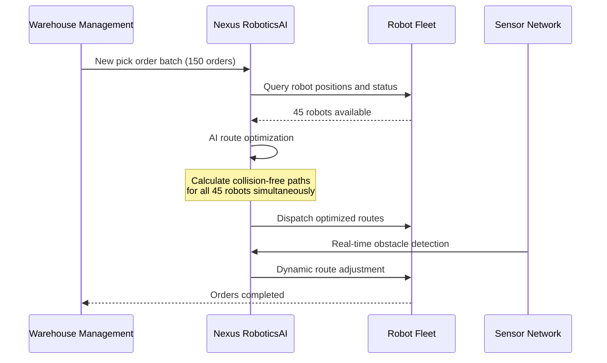
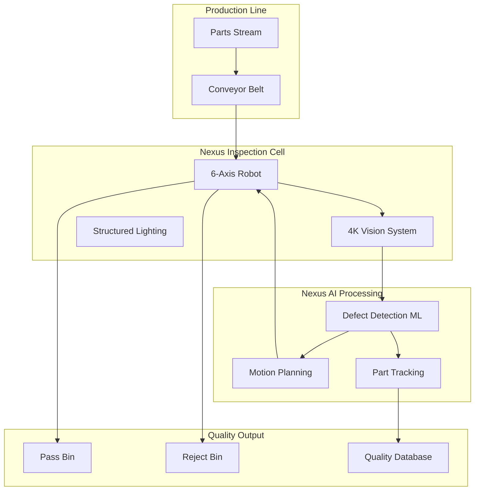
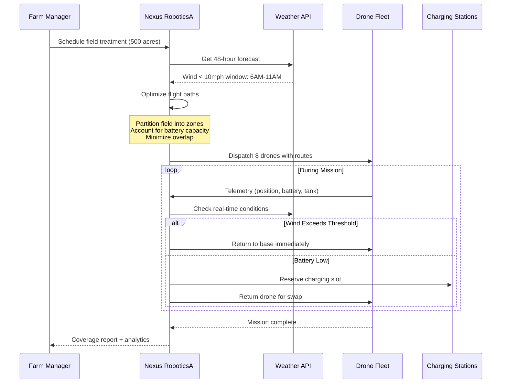
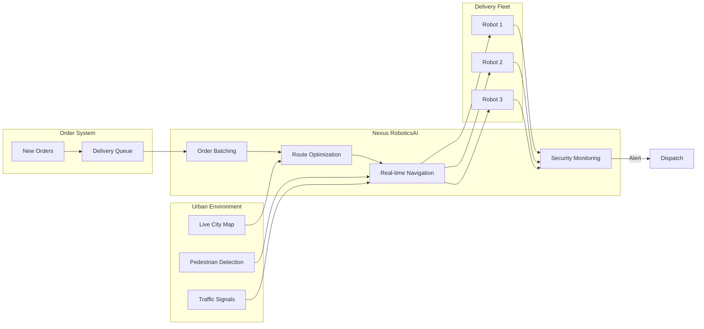
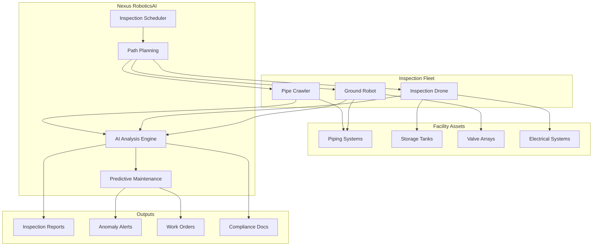

# Use Cases: RoboticsAI - Autonomous Robot Fleet Management

Discover how enterprises leverage Nexus RoboticsAI to transform their operations with AI-powered fleet management, intelligent path planning, and predictive maintenance.

---

## Use Case 1: Warehouse Automation and Order Fulfillment

### The Problem

A major e-commerce fulfillment center operates 200+ autonomous mobile robots (AMRs) across a 500,000 sq ft facility. During peak season, they experience:

- **Frequent traffic jams** when multiple robots converge on popular pick locations
- **Suboptimal routing** that increases travel time by 30%
- **Manual coordination overhead** requiring 5 operators per shift
- **Collision near-misses** causing safety concerns and operational delays

### The Solution

Nexus RoboticsAI provides centralized AI coordination for the entire AMR fleet, optimizing routes in real-time and predicting congestion before it occurs.



### Implementation

```typescript
import { NexusRobotics } from '@nexus/robotics-sdk';

const robotics = new NexusRobotics({ apiKey: process.env.NEXUS_API_KEY });

// Create a batch fulfillment task
const batchTask = await robotics.tasks.createBatch({
  orders: orderBatch.map(order => ({
    orderId: order.id,
    pickLocations: order.items.map(item => item.binLocation),
    packStation: order.assignedStation,
    priority: order.shippingClass === 'express' ? 'high' : 'normal'
  })),
  constraints: {
    maxConcurrentRobots: 50,
    avoidZones: ['maintenance-bay-1', 'charging-stations'],
    preferredLanes: ['main-aisle-a', 'main-aisle-b'],
    optimizeFor: 'throughput'
  }
});

// Monitor fleet progress
robotics.events.on('batch.progress', (event) => {
  console.log(`Completed: ${event.completedOrders}/${event.totalOrders}`);
  console.log(`Active robots: ${event.activeRobots}`);
  console.log(`Estimated completion: ${event.eta}`);
});
```

### Benefits

- **Higher order throughput** through optimized path planning
- **Faster pick times** with AI-guided operations
- **Reduced traffic incidents** via intelligent routing
- **Fewer operators required** per shift
- **Improved robot utilization** across fleet

---

## Use Case 2: Manufacturing Quality Control with Vision-Guided Inspection

### The Problem

An automotive parts manufacturer needs to inspect 10,000 components daily for defects. Current challenges include:

- **Inconsistent human inspection** with 15% false negative rate
- **Bottleneck at inspection stations** limiting production throughput
- **No traceability** linking defects to specific production batches
- **High labor costs** for 24/7 manual inspection coverage

### The Solution

Deploy vision-guided inspection robots that combine Nexus RoboticsAI motion planning with integrated ML defect detection, achieving consistent quality at production speed.



### Implementation

```python
from nexus_robotics import NexusRobotics
from nexus_robotics.vision import InspectionPipeline

client = NexusRobotics(api_key=os.environ['NEXUS_API_KEY'])

# Configure inspection routine
inspection = client.inspection.create(
    robot_id='rob_inspect_01',
    camera_id='cam_4k_01',
    routine={
        'part_type': 'transmission_gear',
        'inspection_points': [
            {'name': 'top_surface', 'pose': {'x': 0, 'y': 0, 'z': 50, 'rx': 0, 'ry': 0, 'rz': 0}},
            {'name': 'side_profile', 'pose': {'x': 0, 'y': 30, 'z': 25, 'rx': 0, 'ry': 90, 'rz': 0}},
            {'name': 'gear_teeth', 'pose': {'x': 0, 'y': 0, 'z': 30, 'rx': 45, 'ry': 0, 'rz': 0}}
        ],
        'defect_types': ['surface_crack', 'porosity', 'dimensional_deviation', 'burr'],
        'tolerance_mm': 0.05
    }
)

# Process incoming parts
async def inspect_part(part_id: str, batch_id: str):
    result = await client.inspection.execute(
        inspection_id=inspection.id,
        part_id=part_id,
        metadata={'batch': batch_id, 'timestamp': datetime.now().isoformat()}
    )

    if result.verdict == 'pass':
        await client.tasks.create(robot_id='rob_inspect_01', task_type='place', target='pass_bin')
    else:
        await client.tasks.create(robot_id='rob_inspect_01', task_type='place', target='reject_bin')
        # Log defect for root cause analysis
        await log_defect(part_id, batch_id, result.defects)

    return result
```

### Benefits

- **Higher inspection throughput** with parallel processing
- **Improved defect detection** via AI vision models
- **Lower false positive rates** through multi-stage verification
- **Reduced labor costs** for quality control
- **Complete defect traceability** for every component

---

## Use Case 3: Agricultural Drone Fleet Coordination

### The Problem

A precision agriculture company manages drone fleets for crop monitoring and targeted spraying across 50,000 acres. Challenges include:

- **Manual flight planning** taking 2 hours per field
- **Weather-related mission failures** wasting flight time and chemicals
- **Overlapping coverage** causing pesticide overuse
- **Battery management** resulting in incomplete missions

### The Solution

Nexus RoboticsAI coordinates drone fleets with dynamic mission planning, real-time weather adaptation, and intelligent battery management.



### Implementation

```typescript
import { NexusRobotics, DroneFleet } from '@nexus/robotics-sdk';

const robotics = new NexusRobotics({ apiKey: process.env.NEXUS_API_KEY });

// Define the treatment mission
const mission = await robotics.drones.createMission({
  name: 'Field-12-Herbicide-Treatment',
  fieldBoundary: fieldGeoJSON,
  missionType: 'spray',
  payload: {
    chemical: 'glyphosate',
    concentration: 2.5, // L/hectare
    tankCapacity: 20 // liters
  },
  constraints: {
    maxWindSpeed: 15, // km/h
    minTemperature: 10, // celsius
    maxTemperature: 35,
    noFlyZones: waterSourceBuffers,
    operatingHours: { start: '06:00', end: '18:00' }
  },
  optimization: {
    minimizeOverlap: true,
    balanceFleetLoad: true,
    reserveBattery: 20 // percent
  }
});

// Monitor mission execution
robotics.drones.onMissionUpdate(mission.id, (update) => {
  console.log(`Coverage: ${update.coveragePercent}%`);
  console.log(`Chemical used: ${update.chemicalUsed}L`);
  console.log(`Active drones: ${update.activeDrones}`);

  if (update.weatherAlert) {
    console.warn(`Weather alert: ${update.weatherAlert.message}`);
  }
});

// Get post-mission analytics
const report = await robotics.drones.getMissionReport(mission.id);
console.log(`Total flight time: ${report.totalFlightMinutes} min`);
console.log(`Coverage efficiency: ${report.coverageEfficiency}%`);
console.log(`Chemical savings vs manual: ${report.chemicalSavingsPercent}%`);
```

### Benefits

- **Faster flight planning** per field with automation
- **Better coverage efficiency** reducing overlaps
- **Reduced chemical usage** through precision targeting
- **Higher mission completion rates** via weather-aware planning
- **More acres covered per day** with coordinated fleets

---

## Use Case 4: Last-Mile Delivery Robot Fleet

### The Problem

An urban delivery company operates sidewalk delivery robots in a 10 sq mile downtown area. They face:

- **Pedestrian congestion** causing unpredictable delivery times
- **Traffic signal timing** not optimized for robot pace
- **Multi-delivery routing** that doubles travel distance
- **Theft and tampering** incidents averaging 3 per week

### The Solution

Nexus RoboticsAI provides real-time pedestrian-aware navigation, multi-stop route optimization, and security monitoring for the delivery fleet.



### Implementation

```python
from nexus_robotics import NexusRobotics
from nexus_robotics.delivery import DeliveryOptimizer

client = NexusRobotics(api_key=os.environ['NEXUS_API_KEY'])

# Configure delivery optimizer
optimizer = DeliveryOptimizer(
    service_area=downtown_geofence,
    fleet_size=25,
    depot_locations=['depot-north', 'depot-south'],
    constraints={
        'max_deliveries_per_trip': 4,
        'max_trip_duration_minutes': 45,
        'pedestrian_speed_limit_mph': 4,
        'avoid_areas': construction_zones + event_closures
    }
)

# Process incoming orders
async def dispatch_deliveries(orders: list):
    # Batch orders into optimal routes
    routes = await optimizer.batch_and_route(orders)

    for route in routes:
        # Select best available robot
        robot = await client.fleet.get_nearest_available(
            location=route.start_location,
            required_capacity=route.total_package_volume
        )

        # Dispatch with real-time navigation
        task = await client.tasks.create(
            robot_id=robot.robot_id,
            task_type='multi_delivery',
            stops=route.stops,
            navigation_mode='pedestrian_aware',
            security={
                'compartment_lock': True,
                'customer_pin_required': True,
                'tamper_detection': True,
                'geofence_alert': route.delivery_geofences
            }
        )

        # Set up customer notifications
        for stop in route.stops:
            await notify_customer(stop.order_id, task.id, stop.eta)

# Handle security events
client.events.on('security.tamper_detected', async (event) => {
    await alert_dispatch(event.robot_id, event.location)
    await client.robots.command(event.robot_id, 'lock_and_alarm')
)
```

### Benefits

- **More deliveries per robot per day** with optimized routing
- **Higher on-time delivery rates** via real-time traffic data
- **Faster average delivery times** through smart scheduling
- **Fewer security incidents** with AI-powered monitoring
- **Improved customer satisfaction** with reliable service

---

## Use Case 5: Industrial Inspection and Maintenance Robots

### The Problem

A petrochemical facility requires regular inspection of 5,000+ assets across a hazardous environment. Current challenges:

- **Manual inspections** expose workers to toxic environments
- **Inconsistent documentation** making trend analysis impossible
- **Reactive maintenance** causing unplanned shutdowns
- **Compliance gaps** risking regulatory penalties

### The Solution

Deploy inspection robots coordinated by Nexus RoboticsAI for autonomous asset inspection, AI-powered anomaly detection, and predictive maintenance scheduling.



### Implementation

```typescript
import { NexusRobotics, InspectionScheduler } from '@nexus/robotics-sdk';

const robotics = new NexusRobotics({ apiKey: process.env.NEXUS_API_KEY });

// Configure inspection schedule based on asset criticality
const scheduler = new InspectionScheduler({
  assets: facilityAssetDatabase,
  inspectionFrequency: {
    critical: { intervalDays: 7, thoroughness: 'detailed' },
    high: { intervalDays: 14, thoroughness: 'standard' },
    medium: { intervalDays: 30, thoroughness: 'basic' },
    low: { intervalDays: 90, thoroughness: 'visual' }
  },
  fleetAssignment: {
    'piping': ['ground-bot-1', 'pipe-crawler-1'],
    'tanks': ['drone-1', 'drone-2'],
    'electrical': ['ground-bot-2'],
    'elevated': ['drone-1', 'drone-2', 'drone-3']
  }
});

// Execute daily inspection rounds
async function runDailyInspections() {
  const todaysInspections = await scheduler.getScheduledInspections(new Date());

  for (const inspection of todaysInspections) {
    const result = await robotics.inspection.execute({
      assetId: inspection.assetId,
      robotId: inspection.assignedRobot,
      inspectionType: inspection.type,
      sensors: ['thermal', 'visual', 'ultrasonic', 'gas'],
      dataCapture: {
        images: true,
        thermalMap: true,
        measurements: inspection.measurementPoints,
        audioAnalysis: inspection.hasRotatingEquipment
      }
    });

    // AI analysis for anomaly detection
    const analysis = await robotics.analysis.detectAnomalies({
      inspectionId: result.id,
      compareToBaseline: true,
      detectTypes: ['corrosion', 'leak', 'thermal_anomaly', 'vibration_change']
    });

    if (analysis.anomaliesDetected.length > 0) {
      await createMaintenanceWorkOrder(inspection.assetId, analysis.anomaliesDetected);
      await notifyOperations(inspection.assetId, analysis.severity);
    }

    // Update predictive maintenance model
    await robotics.maintenance.updatePrediction({
      assetId: inspection.assetId,
      inspectionData: result.measurements,
      anomalies: analysis.anomaliesDetected
    });
  }
}

// Get predictive maintenance forecast
const forecast = await robotics.maintenance.getForecast({
  timeHorizon: 90, // days
  confidenceThreshold: 0.85
});

console.log(`Assets requiring attention in next 90 days: ${forecast.length}`);
forecast.forEach(item => {
  console.log(`${item.assetId}: ${item.predictedIssue} - ${item.recommendedAction}`);
});
```

### Benefits

- **Reduced worker exposure** to hazardous environments
- **Complete inspection coverage** across all assets
- **Improved anomaly detection** via AI analysis
- **Less unplanned downtime** through predictive maintenance
- **Higher compliance scores** with documented inspections
- **Lower maintenance costs** through proactive repairs

---

## Summary: Key Benefits Across Use Cases

| Capability | Warehouse | QC/Inspection | Agriculture | Delivery | Industrial |
|------------|-----------|---------------|-------------|----------|------------|
| **AI Path Planning** | Multi-robot coordination | Optimal inspection angles | Weather-aware routing | Pedestrian avoidance | Hazardous navigation |
| **Predictive Maintenance** | Fleet health | Camera calibration | Drone battery life | Motor wear | Asset condition |
| **Real-time Adaptation** | Traffic avoidance | Defect response | Weather changes | Congestion routing | Safety zones |
| **Analytics** | Throughput metrics | Quality trends | Coverage maps | Delivery KPIs | Compliance reports |

---

## Getting Started

Ready to implement these use cases in your organization?

1. **Schedule a Demo**: [adverant.ai/demo](https://adverant.ai/demo)
2. **Start Free Trial**: [marketplace.adverant.ai/plugins/robotics](https://marketplace.adverant.ai/plugins/robotics)
3. **Read the Docs**: [docs.adverant.ai/plugins/robotics](https://docs.adverant.ai/plugins/robotics)
4. **Join Community**: [discord.gg/adverant](https://discord.gg/adverant)

---

**Questions?** Contact our solutions team at solutions@adverant.ai
